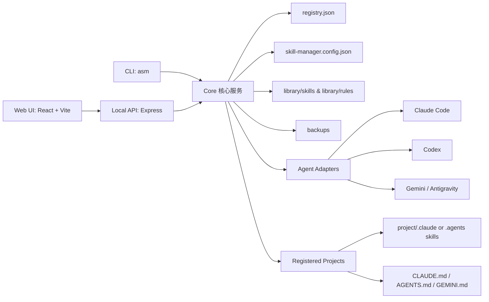
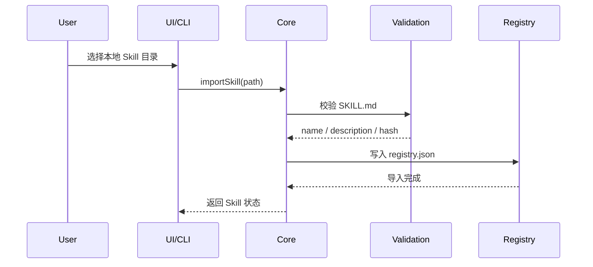
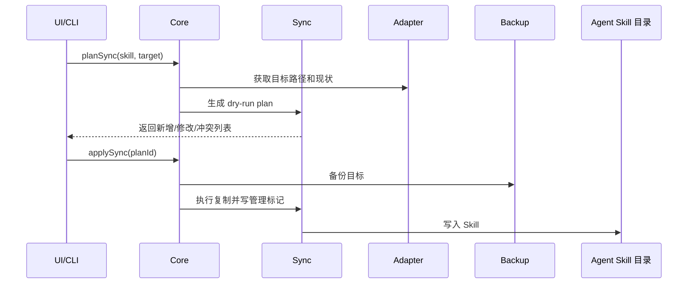
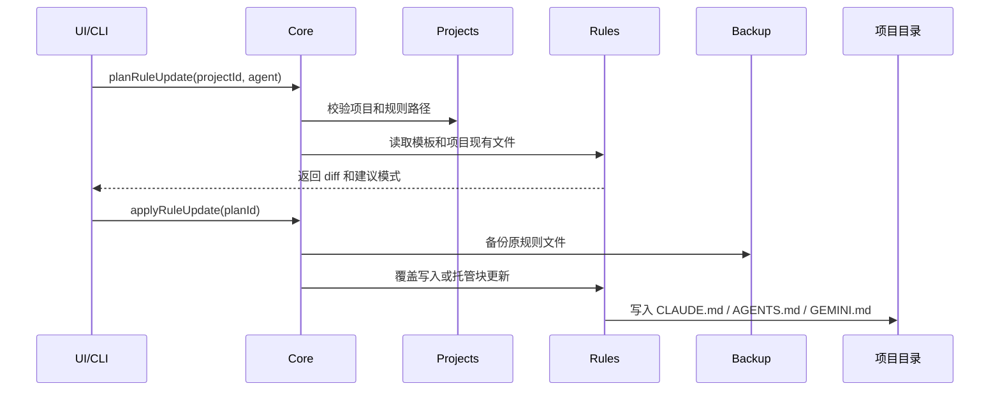

# Skill 管理器架构说明

本文档基于 [Skill管理器建设计划.md](./Skill管理器建设计划.md) 提炼，说明 Skill 管理器的目标架构、目录职责、核心模块边界和主要数据流。

当前仓库仍处于方案阶段，尚未创建实际工程代码。下文中的目录结构是后续 TypeScript / Node.js / React 实现时建议采用的目标结构。

## 1. 项目定位

Skill 管理器是一个本地工具，用于统一维护 Agent Skills、项目级 Agent 规则文件，并按需同步到不同 Agent。

首版重点能力：

- 管理本地标准 Skill 源库。
- 从已有目录导入 Skill。
- 同步 Skill 到 Claude Code、Codex、Gemini / Antigravity。
- 给指定项目注入项目级 Skill。
- 管理项目规则文件：`CLAUDE.md`、`AGENTS.md`、`GEMINI.md`。
- 所有写入先生成 dry-run，再确认执行。
- 写入前自动备份，支持恢复。
- 支持本地 hash / mtime 更新检查，不依赖远程市场。

## 2. 总体架构

系统采用前后端分离加共享核心模块的本地架构：



设计原则：

- CLI 和 Web UI 共用同一套核心逻辑，避免行为不一致。
- Web UI 不直接写文件，所有写入通过本地 API 进入核心模块。
- Agent 差异封装在 `adapters` 中，核心同步流程保持统一。
- 复制、备份、diff、冲突判断集中在同步引擎中。
- 项目级写入必须限制在已注册项目路径内部。

## 3. 目标目录结构

```text
AgentSkillManager
├── package.json
├── tsconfig.json
├── skill-manager.config.json
├── library
│   ├── registry.json
│   ├── skills
│   │   └── <skill-name>
│   │       ├── SKILL.md
│   │       ├── scripts
│   │       ├── references
│   │       └── assets
│   └── rules
│       ├── claude
│       │   └── CLAUDE.md
│       ├── codex
│       │   └── AGENTS.md
│       ├── gemini
│       │   └── GEMINI.md
│       └── common
│           └── AIWorkLog.md
├── backups
├── src
│   ├── cli
│   ├── server
│   ├── core
│   ├── adapters
│   ├── projects
│   ├── rules
│   ├── sync
│   ├── backup
│   └── validation
└── web
    ├── index.html
    └── src
```

## 4. 根目录文件说明

| 路径 | 用途 | 设计说明 |
| --- | --- | --- |
| `package.json` | Node.js 项目声明 | 维护 CLI、服务端、前端构建、测试等 npm scripts。 |
| `tsconfig.json` | TypeScript 编译配置 | 建议统一配置路径别名、严格类型检查和编译输出目录。 |
| `skill-manager.config.json` | 本地全局配置 | 记录备份目录、目标 Agent 路径、注册项目、规则模板目录等。 |
| `library/` | 本地资产库 | 存放标准 Skill、规则模板和注册表，是管理器的核心数据源。 |
| `backups/` | 备份目录 | 所有覆盖写入前的目标文件或目录都应先备份到这里。 |
| `src/` | 后端、CLI 与核心业务代码 | 实现扫描、导入、同步、备份、恢复、适配器等能力。 |
| `web/` | 本地 Web UI | React + Vite 前端，只通过本地 API 调用后端能力。 |

## 5. `library` 目录设计

`library` 是管理器的统一源库，不直接代表某个 Agent 的实际安装目录。

### 5.1 `library/skills`

用于存放标准 Agent Skill 包：

```text
library/skills/<skill-name>/SKILL.md
library/skills/<skill-name>/scripts
library/skills/<skill-name>/references
library/skills/<skill-name>/assets
```

约束：

- 每个 Skill 必须包含 `SKILL.md`。
- `SKILL.md` 必须包含 `name` 和 `description`。
- `<skill-name>` 建议与 `SKILL.md` 中的 `name` 保持一致。
- `scripts/`、`references/`、`assets/` 为可选目录。

使用方式：

- 导入本地已有 Skill 后，在注册表中登记来源路径和 hash。
- 同步时以此目录或绑定的开发目录作为源端。
- 不在这里存放 Agent 专属的运行态副本。

### 5.2 `library/rules`

用于维护项目规则文件模板：

```text
library/rules/claude/CLAUDE.md
library/rules/codex/AGENTS.md
library/rules/gemini/GEMINI.md
library/rules/common/AIWorkLog.md
```

设计说明：

- `claude` 放 Claude Code 项目规则模板。
- `codex` 放 Codex / 通用 Agent 项目规则模板。
- `gemini` 放 Gemini / Antigravity 项目规则模板。
- `common` 放可复用的公共规则片段或项目工作日志模板。

规则写入策略：

- 新项目没有规则文件时，可以直接新建。
- 已有规则文件默认展示 diff。
- 有托管块时优先只更新托管块。
- 没有托管块时不自动覆盖，必须用户确认。

### 5.3 `library/registry.json`

用于记录所有已导入 Skill 的元信息和同步状态。

建议记录内容：

- Skill 名称、版本、描述。
- 本地来源路径 `localPath`。
- 内容校验值 `checksum`。
- 已同步的用户级目标。
- 已安装的项目级目标。
- 最近扫描时间和同步状态。

`registry.json` 是 CLI 与 Web UI 展示一致性的基础，所有状态刷新都应回写这里。

## 6. `src` 目录设计

### 6.1 `src/cli`

CLI 入口，建议命令名为 `asm`。

职责：

- 解析命令行参数。
- 调用核心服务生成 plan 或执行操作。
- 输出列表、diff、dry-run、备份恢复结果。

典型命令：

- `asm list`
- `asm scan`
- `asm import <path>`
- `asm sync <skill-name> --dry-run`
- `asm project inject <project-id> <skill-name> --agent <agent>`
- `asm project push-rules <project-id> --agent <agent>`

### 6.2 `src/server`

本地 Express 服务。

职责：

- 提供 Web UI 所需 API。
- 接收扫描、导入、同步、备份、恢复等请求。
- 对写操作要求先生成 plan，再通过 `planId` 执行 apply。

边界：

- 不直接实现业务逻辑。
- 不直接绕过核心模块写文件。
- 不暴露远程公网服务，首版仅服务本机。

### 6.3 `src/core`

核心编排层。

职责：

- 统一加载配置和注册表。
- 调度 Skill 校验、目标扫描、同步计划、备份恢复。
- 为 CLI 和 Server 提供稳定的应用服务接口。

建议拆分：

- 配置服务。
- 注册表服务。
- 扫描服务。
- 应用级 use case，例如 `importSkill`、`planSync`、`applySync`。

### 6.4 `src/adapters`

Agent 适配器目录，每个 Agent 一个适配器。

建议结构：

```text
src/adapters/claude.ts
src/adapters/codex.ts
src/adapters/gemini.ts
src/adapters/types.ts
```

适配器职责：

- 识别用户级 Skill 目录。
- 识别项目级 Skill 目录。
- 读取目标端已有 Skill 状态。
- 返回对应项目规则文件路径。
- 生成目标端写入路径。

适配器不负责：

- 冲突策略。
- diff 策略。
- 是否覆盖。
- 备份恢复。

这些统一交给 `src/sync`、`src/rules` 和 `src/backup`。

### 6.5 `src/projects`

项目工作区模块。

职责：

- 注册项目名称、绝对路径、启用的 Agent。
- 扫描项目中的 `.claude/skills`、`.agents/skills`、`.gemini/skills`。
- 扫描 `CLAUDE.md`、`AGENTS.md`、`GEMINI.md` 等规则文件。
- 校验项目级写入必须位于项目目录内部。
- 给 UI 和 CLI 返回项目级安装状态。

安全约束：

- 不允许写出已注册项目根目录。
- 不允许对未注册项目执行项目级写入。
- 写入前必须经过 dry-run 和备份。

### 6.6 `src/rules`

规则模板同步模块。

职责：

- 读取规则模板。
- 读取项目中已有规则文件。
- 生成文本 diff。
- 支持覆盖写入、托管块更新、拉取为模板。
- 管理托管块标记：

```md
<!-- BEGIN AgentSkillManager:codex -->
由 Skill 管理器维护的规则片段。
<!-- END AgentSkillManager:codex -->
```

首版不做复杂 AST 合并，只做整文件 diff 和托管块替换。

### 6.7 `src/sync`

同步引擎。

职责：

- 比对源目录和目标目录 hash。
- 生成 dry-run 操作计划。
- 判断新增、跳过、覆盖、冲突。
- 触发备份。
- 执行复制。
- 写入 `.skill-manager-deploy.json` 管理标记。

冲突策略：

- hash 相同：跳过。
- 目标不存在：新增。
- 目标不同且无管理标记：标记冲突，不覆盖。
- 目标不同且有管理标记：展示 diff，确认后备份并覆盖。

### 6.8 `src/backup`

备份恢复模块。

职责：

- 写入前备份目标文件或目录。
- 生成批量备份索引。
- 支持按备份 ID 恢复。
- 支持恢复单个 Skill、单个规则文件或一次同步涉及的全部目标。

备份索引应记录：

- `backupId`
- 创建时间。
- 操作原因。
- 原始路径。
- 备份路径。
- 目标 Agent。
- 项目 ID。

### 6.9 `src/validation`

校验模块。

职责：

- 校验 `SKILL.md` 是否存在。
- 校验 `name` 和 `description`。
- 校验 Skill 名称合法性。
- 校验路径是否存在、是否可读写。
- 校验同步目标是否在允许范围内。
- 校验项目写入是否越界。

该模块应被导入、扫描、同步、项目注入、规则写入共同复用。

## 7. `web` 目录设计

`web` 是本地管理 UI，技术栈为 React + Vite。

建议页面：

- Skills 列表页：展示所有已导入 Skill 和多 Agent 同步状态。
- 项目空间页：管理注册项目、项目级 Skill、项目规则文件。
- 导入页或导入弹窗：选择本地 Skill 目录并校验。
- Diff 确认弹窗：展示 dry-run、diff、备份位置和 apply 按钮。
- 备份恢复页：查看备份索引并执行恢复。
- 设置页：配置目标 Agent 路径、备份目录、开发目录。

前端边界：

- 不直接访问文件系统。
- 不自行计算最终写入结果。
- 所有写入必须调用 plan API，再用 `planId` 调用 apply API。

## 8. 核心数据流

### 8.1 导入 Skill



### 8.2 同步到用户级 Agent



### 8.3 项目级规则更新



## 9. 配置文件设计

### 9.1 `skill-manager.config.json`

保存本机运行配置。

建议字段：

- `backupDir`：备份目录。
- `devDir`：Skill 开发目录。
- `ruleTemplateDir`：规则模板目录。
- `targets`：Claude、Codex、Gemini 等目标配置。
- `projects`：已注册项目列表。

配置原则：

- Windows 路径必须支持反斜杠。
- 项目路径必须是绝对路径。
- 目标 Agent 可以启用或禁用。
- Antigravity 加载状态需要单独标记为“路径已写入但加载未验证”。

### 9.2 `registry.json`

保存被管理 Skill 的状态。

建议字段：

- `name`
- `version`
- `localPath`
- `checksum`
- `syncedTargets`
- `projectInstalls`
- `updatedAt`

使用原则：

- 扫描和同步后应更新注册表。
- dry-run 不修改注册表。
- apply 成功后再写入最终状态。

## 10. 写入安全设计

所有写入类操作必须满足：

- 先生成 dry-run。
- 用户确认后再 apply。
- apply 请求必须携带 `planId`。
- 写入前备份。
- 项目写入不能越过项目根目录。
- 非本工具管理的同名目标不自动覆盖。
- 规则文件存在且无托管块时不自动覆盖。

写入管理标记建议：

```json
{
  "managedBy": "AgentSkillManager",
  "skillName": "example-skill",
  "sourcePath": "D:\\AgentSkillManager\\library\\skills\\example-skill",
  "sourceHash": "sha256:...",
  "target": "codex:project",
  "projectId": "example-project",
  "deployedAt": "2026-07-03T00:00:00+08:00"
}
```

## 11. 扩展设计

后续可以在不改核心流程的前提下扩展：

- 新 Agent：在 `src/adapters` 新增适配器。
- 新规则文件：在 `library/rules` 增加模板，并在适配器中声明规则路径。
- ZIP 安装：在导入流程前增加解压和校验。
- 远程市场：在导入来源中增加远程下载源。
- Watch Mode：通过 chokidar 监听 `localPath`，变更后触发 plan 和同步。
- Monaco Diff：替换前端 diff 展示，不改变后端 plan 模型。

## 12. 建议实施顺序

1. 创建 TypeScript 工程骨架和基础配置。
2. 实现 `library`、`registry.json`、`skill-manager.config.json` 的读写。
3. 实现 Skill 校验、hash 计算、扫描和导入。
4. 实现 Claude / Codex 用户级适配器。
5. 实现 dry-run 同步计划和 apply。
6. 实现备份恢复。
7. 实现项目注册、项目扫描和项目级 Skill 注入。
8. 实现规则模板 diff、托管块更新和拉取。
9. 实现本地 API。
10. 实现 Web UI。
11. 补充 Antigravity 写入和加载验证。
12. 增加 Watch Mode。

